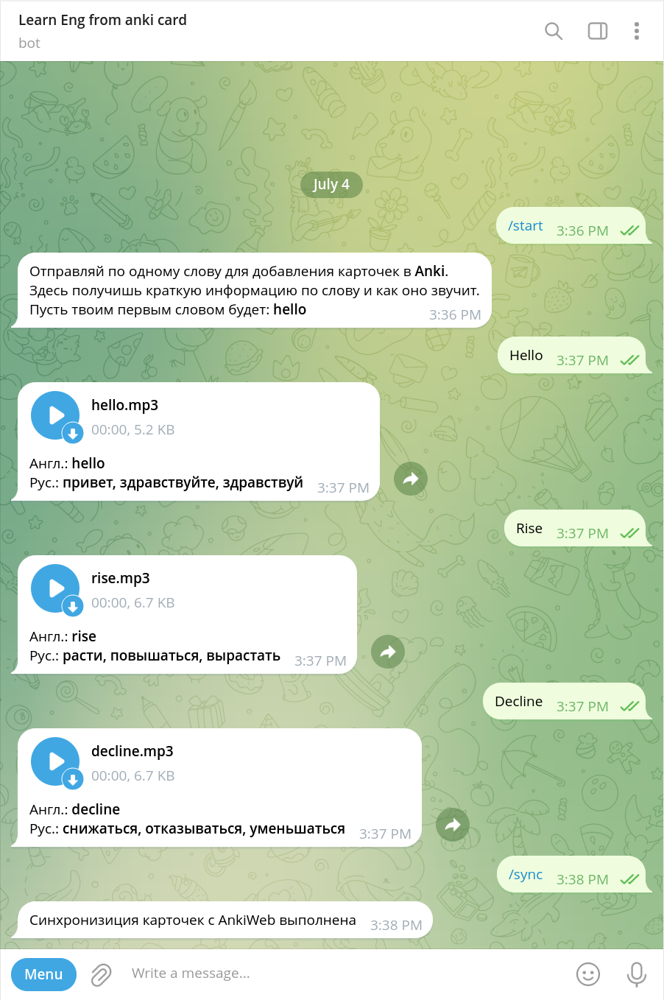
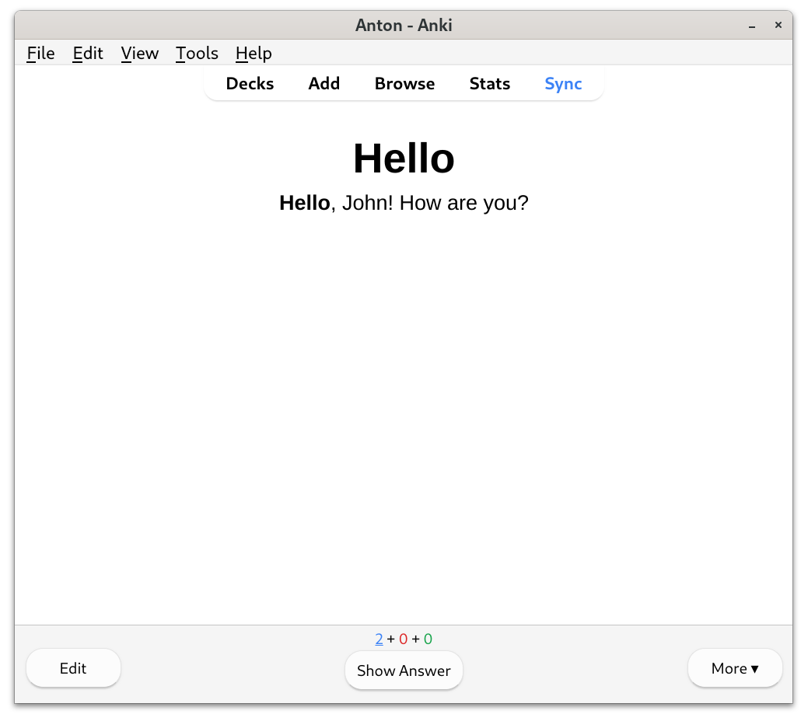
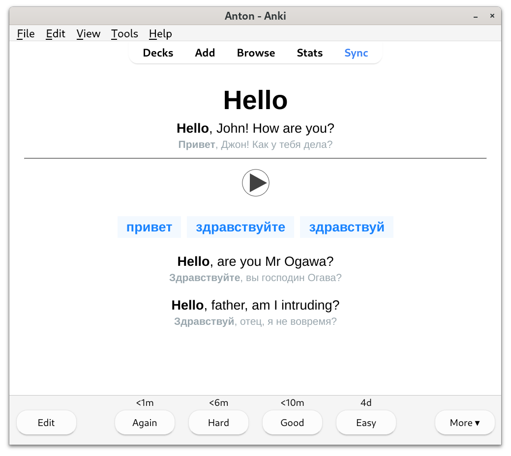

# Telegram bot for learning English words using [Anki](https://apps.ankiweb.net/) cards.

<a href="https://apps.ankiweb.net/"></a>

## For example

<div align="center" width="100%">
    <br>
    <br>
    
</div>

## Bot Commands:

- `/start` — start message
- `/sync` — sync with AnkiWeb


## Instructions

```bash
git clone https://github.com/anton-savenchuk/anki_learning_bot.git
cd anki_learning_bot
```

Create a file called `.env` in the `app` application folder with a environment variable`TELEGRAM_BOT_TOKEN` initialized to the token_id of your telegram bot
```bash
echo "TELEGRAM_BOT_TOKEN = '<your_bot_token_id>'" > app/.env
```

and `ADMIN_ID` variable from your telegram user id, one of the ways you can obtain those ids is using [userinfobot](https://telegram.me/userinfobot).
```bash
echo "ADMIN_ID" = '<your_telegram_user_id>' >> app/.env
```
or in the application folder `app`, change the file `.env.example` by filling in the environment variables and rename it to `.env`


## Build and run docker-compose

```bash
cd anki_learning_bot
docker-compose up --build
```


## Anki-desktop setup

The application is available via VNC on port **3000**.

Open http://127.0.0.1:3000

To synchronize anki, add-ons such as [Anki-Connect](https://ankiweb.net/shared/info/2055492159) are used. The application is accessible via a web interface connected to port **8765**.

Be aware that due to the design of Anki, you cannot run two different clients with same account at the same time.

The installation process is similar to other Anki plugins and can be accomplished in four steps:

1. Open the `Install Add-on` dialog by selecting `Tools` | `Add-ons` | `Get Add-ons...` in Anki.
2. Input [2055492159](https://ankiweb.net/shared/info/2055492159) into the text box labeled `Code` and press the `OK` button to proceed.
3. Select Add-on, go to the configuration, edit `"webBindAddress": "127.0.0.1"` so `"webBindAddress": "anki-desktop"`.
4. Close Anki when prompted to restart to complete the installation of Anki-Connect. Anki will start automatically.

Anki must be kept running in the background in order for other applications to be able to use Anki-Connect.


## Anki-desktop sync setup

`User 1` is the default Anki user, to sync your cards with ankiweb, click sync button, enter your login and password.
For correct synchronization via telegram open the `Syncing` dialog by selecting `Tools` | `Preferences`, uncheck the boxes next to:
- `"Automatically sync on profile open/close"`
- `"Periodically sync media"`
- `"On next sync, force changes in one direction"`


## Enjoy using it...
